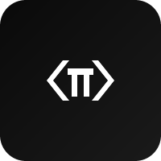

<p align="center">
  
</p>

# pi-workbench

A self-hosted browser workbench for the [pi coding agent](https://github.com/badlogic/pi-mono).
Chat with the agent against your code, browse files, run a terminal, review
diffs, all from one tab. Single-tenant, container-native.

> Status: in active development. Things will change between releases.

## Quick start

```bash
git clone https://github.com/Devin-Marks/pi-workbench.git
cd pi-workbench
cp docker/.env.example docker/.env       # edit auth + paths if you want
cd docker && docker compose up -d --build
```

Open <http://localhost:3000>. Add a project (point at a folder under
`WORKSPACE_PATH`), drop a provider API key into Settings, and start a
session.

For non-Docker workflows, production deploys, Kubernetes, and configuration
details, follow the links in [Documentation](#documentation) below.

## What's in the box

- **Chat** with the agent over a streaming SSE-backed conversation.
- **File browser + editor** wired to your project's filesystem, with
  diff review on every edit the agent makes.
- **Integrated terminal** in the project's working directory.
- **Git panel** — status, diff, stage, commit, push, branches, log.
- **Session branching** — fork at any turn, navigate the tree.
- **Token + cost inspector** per turn so you see what the agent's
  spending.
- **REST + SSE API** — the same surface the UI uses, scriptable from
  curl / Python / Node. Interactive Swagger at `/api/docs`.
- **Installable PWA** — add to home screen on desktop or mobile.

## Documentation

| Topic | File |
|---|---|
| Architecture & data flow | [`docs/architecture.md`](./docs/architecture.md) |
| Configuration & env vars | [`docs/configuration.md`](./docs/configuration.md) |
| Docker image | [`docs/CONTAINERS.md`](./docs/CONTAINERS.md) |
| Production deployment | [`docs/deployment.md`](./docs/deployment.md) |
| Kubernetes / OpenShift | [`kubernetes/DEPLOY.md`](./kubernetes/DEPLOY.md) |
| Scripting against the API | [`docs/api-examples.md`](./docs/api-examples.md) |
| SSE event catalogue | [`docs/sse-events.md`](./docs/sse-events.md) |
| Security model | [`SECURITY.md`](./SECURITY.md) |
| Privacy | [`PRIVACY.md`](./PRIVACY.md) |
| Contributing | [`CONTRIBUTING.md`](./CONTRIBUTING.md) |
| Code of Conduct | [`CODE_OF_CONDUCT.md`](./CODE_OF_CONDUCT.md) |

For project conventions and the agent-facing architecture notes, see
[`CLAUDE.md`](./CLAUDE.md).

## Risks & disclaimer

pi-workbench is a self-hosted developer tool, provided **"as is"** under
the MIT [LICENSE](./LICENSE) — no warranty, no support obligation, no
certification (SOC 2, HIPAA, PCI DSS, FedRAMP, etc.). It is not designed
or suitable for safety-critical, life-critical, or regulated-data
contexts. Specific risks worth knowing before you deploy it:

- **LLM hallucinations.** The agent can produce plausible-looking code
  and explanations that are wrong. Review what it writes before running
  or shipping it.
- **Real tool side effects.** The agent's `bash`, `write`, and `edit`
  tools take real action on your filesystem and can run arbitrary
  commands as the workbench user. Treat the agent with the same caution
  you'd apply to any pair-programmer who can run `rm -rf`.
- **Provider data flow.** Your prompts, attached files, and tool
  outputs are sent to whichever LLM provider you configure. The
  provider's terms govern retention, logging, and training — not
  pi-workbench. Read them.
- **Cost overruns.** A misconfigured agent or a stuck loop can burn
  tokens fast. Set provider-side spending limits; pi-workbench surfaces
  per-turn cost in the Context Inspector but enforces no caps of its
  own.
- **Prompt injection.** Content the agent reads (file contents, tool
  output, web pages) can contain instructions that override yours. The
  pi SDK mitigates the worst cases; the residual threat is real.
- **Network exposure.** The container speaks plain HTTP. Exposing it
  to the public internet without TLS at a reverse proxy + auth is
  unsafe — see [`SECURITY.md`](./SECURITY.md) and
  [`docs/deployment.md`](./docs/deployment.md).
- **Jurisdictional regulation.** AI use is regulated differently
  across jurisdictions (EU AI Act, US state AI bills, sector-specific
  rules in finance / health / law). Compliance is on you.

Operating pi-workbench means you accept these risks. To the maximum
extent permitted by law, no party associated with this project is
liable for any damages arising from your use of it — see the LICENSE
for the controlling text.

## Related projects

- [pi-mono](https://github.com/badlogic/pi-mono) — the upstream pi
  agent SDK and reference TUI.

## License

MIT — see [`LICENSE`](./LICENSE).
